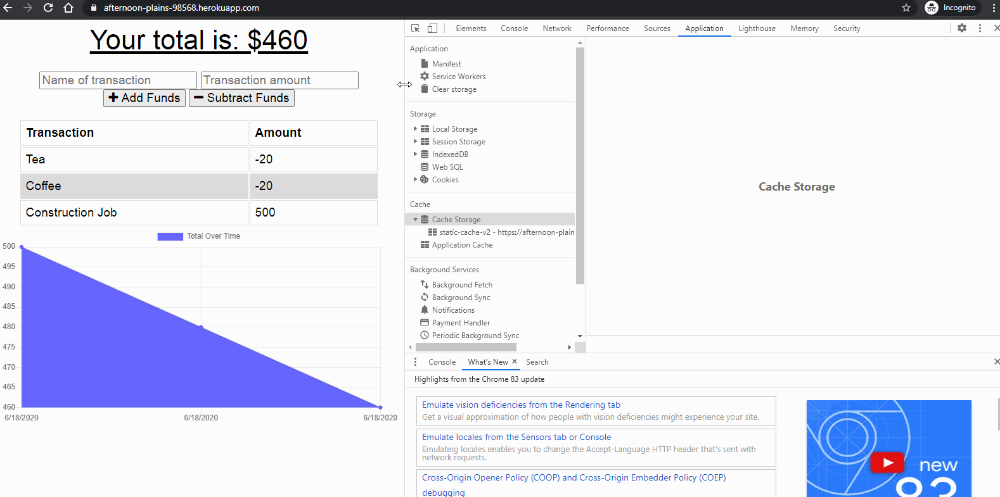

# Progressive Budget Tracker

A progressive budget tracking web-app that works in offline mode as well. It uses service-worker, Index db to cached static file, api responses to provide smooth experience for user even when they have no connectivity.

## Table of Contents

- [Description](#Description)
- [Installation](#Installation)
- [Usage](#Usage)
- [Credits](#Credits)
- [License](#License)
- [Contributing](#Contributing)
- [Tests](#Tests)
- [Questions](#Questions)

## Description

A webpage that lets you track your expenses and earnings. It uses Express, MongoDb on Node for the back-end and Manifest, Service-Worker, and Indexed Db on the browser side to provide smooth offline experience. User's offline transactions get posted when they get the network connectivity back again.
It uses web-pack on the build side to automatically generate the manifest and icons and the bundled production javascript files.
An instance on this Web-app is deployed at -
https://afternoon-plains-98568.herokuapp.com/

## Installation

To set-up the Web-app on your local machine, follow these steps -

- Set Up MongoDB server.
- Run <code>npm install</code>.
- Run <code>npm start</code>.

## Usage

- Run <code>node./server.js</code> or <code>npm start</code> .

## Credits

sandyboon(https://github.com/sandyboon)

## License

Licensed under the MIT license.

## Contributing

Contribution to this project is not permitted at this moment.

## Tests

There are no tests at this moment.

## Questions

### Email : sandy.boon@gmail.com
